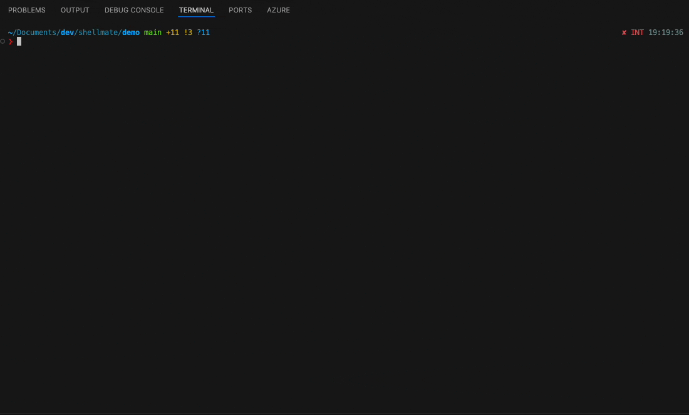

# ShellMate

AI-powered natural language to shell command converter using AWS Bedrock.

```bash
shellmate "list all python files older than 5 days"
# Generates: find . -name "*.py" -mtime +5
```

## Demo



## Prompt Tuning

The system prompt has been tuned to generate simple, intuitive shell commands that follow standard Unix/Linux conventions. You can further customize the prompt in `aws/lambda_function.py` to improve performance for your specific use cases. Command quality and style may vary depending on the AI model version and configuration.

## Prerequisites

- **AWS Account** with Bedrock access (enable Claude 3 Haiku model with default settings)
- **AWS CLI** + **SAM CLI** installed and configured (https://docs.aws.amazon.com/serverless-application-model/latest/developerguide/install-sam-cli.html)
- **Bash + curl** installed

## Install

```bash
# 1. Deploy AWS infrastructure
./shellmate-installer.sh deploy

# 2. Install locally
./shellmate-installer.sh install
```

## Usage

```bash
shellmate "your natural language query"
shellmate "show disk usage"
shellmate "find large files bigger than 100MB"
```

## Uninstall

```bash
# Remove local installation only
./shellmate-installer.sh uninstall

# Remove everything (AWS + local) - PERMANENT!
./shellmate-installer.sh destroy
./shellmate-installer.sh uninstall
```

---

**Need help?** See [FAQ.md](FAQ.md) for troubleshooting and detailed usage.

**Implementation details?** See [IMPLEMENTATION.md](IMPLEMENTATION.md) for technical information.
